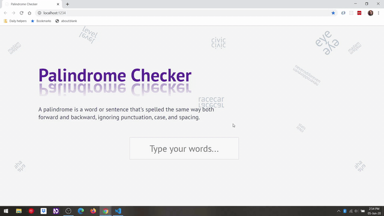

# Palindrome Checker

While going through the JavaScript Algorithms and Data Structures Certification curriculum I had to write a function which checks if a string is a palindrome or not. _A palindrome is a word or sentence that's spelled the same way both forward and backward, ignoring punctuation, case, and spacing (e.g. civic, level, eye, aha)._

I've decided to take this challenge a bit further and implement an UI for it and dive more into testing. You can check the live example [here](https://alexandracaulea.github.io/palindrome-checker/).

For unit testing I've used [Jest](https://jestjs.io/) and for end to end testing I've used [Puppeteer](https://pptr.dev/). This is my first time testing my own code and also the first time using Jest and Puppeteer in a project.

## Installation

1. Clone the repository: `git clone https://alexandracaulea.github.io/palindrome-checker`
2. Install project dependencies by running: `npm install`

## Using this repository

1. For the development run: `npm run dev`
2. To build run `npm run build`

